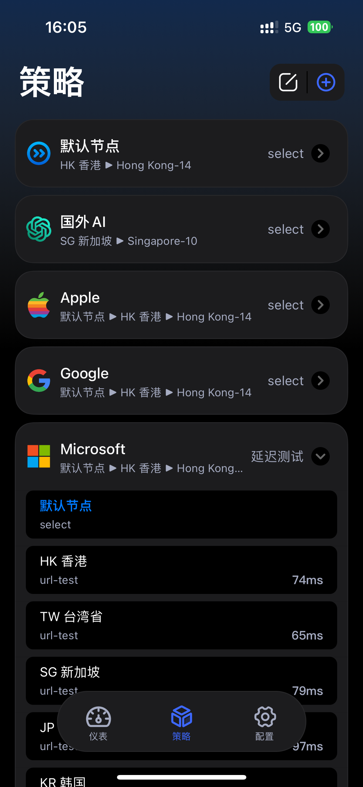

# Loon

## 按应用区分策略组，节点按地区归类

### 支持的应用规则

* 国外AI：包括国外主流的AI服务
* Apple：苹果非中国区服务
* Google
* Microsoft：微软非中国区服务
* Telegram
* 哔哩哔哩东南亚：bilibili.tv，新加坡区B站APP已解锁部分功能，可以流程观看视频
* 巴哈姆特
* YouTube
* NETFLIX
* Disney+
* Tiktok
* Spotify
* 广告拦截：本规则可大幅减少APP开屏广告
* 其他外网
* 国内网站：非中国IP的网站

### 使用注意

1. 删除上述的策略组前记得先删除对应的规则
2. 配置文件里的rewrite如果和某些插件有冲突，可以删除
3. 导入新配置前记得先备份现有配置！！！
