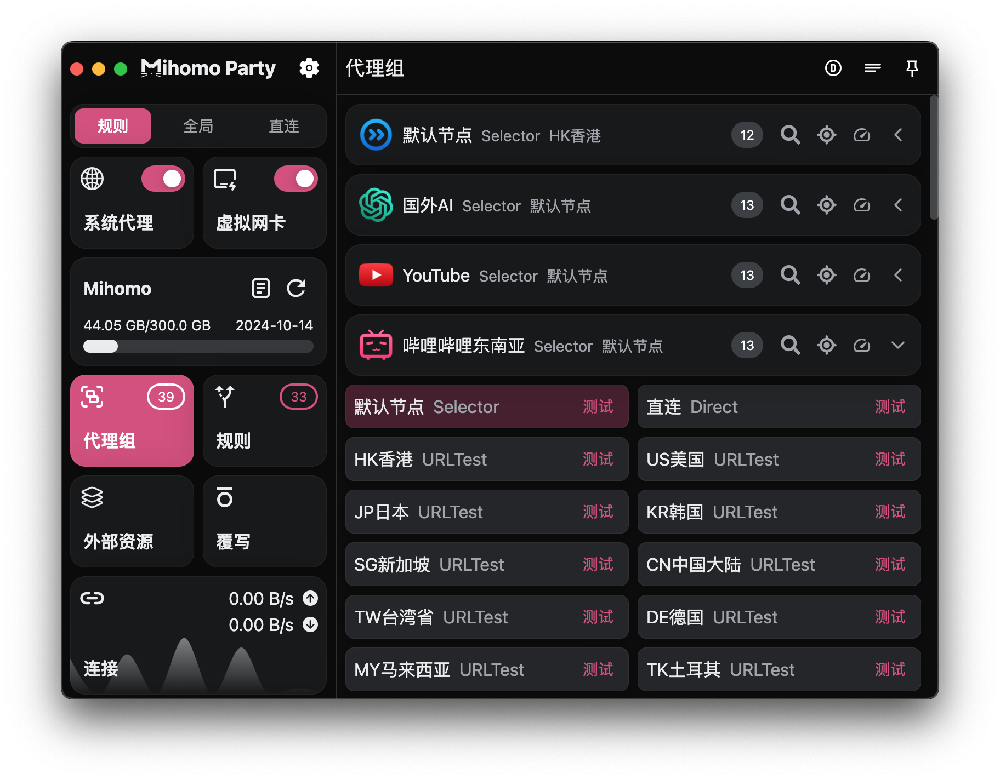

# Clash Verge Rev 全局脚本 懒人配置 / Mihomo Party 覆写脚本

| Clash Verge Rev                           | Mihomo Party                      |
| ----------------------------------------- | --------------------------------- |
|  |  |

## Mihomo Party 订阅链接

`kkk`

- 本脚本包含 DNS 设置，在 Mihomo Party 里使用可以尝试在`应用设置`里关闭`接管DNS设置`和`接管域名嗅探设置`
- **全局脚本和全局配置，用其中一种就可以了**
- 初次使用请阅读脚本代码的前 100 行，对脚本的功能有个大概的理解

## Big Changelog

- 2024-09-27：添加的功能控制开关，增加策略组和分流规则
- 2024-09-24：未符合分类规则的节点全扔进其他节点策略组里
- 2024-09-22：大更新，优化图标、策略组，提升易用性
