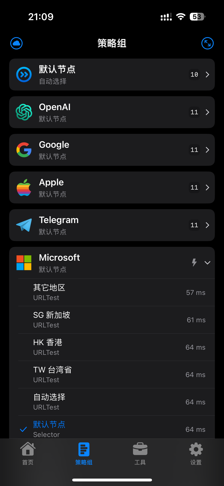

# Stash

## 按应用区分策略组，节点按地区归类

### 支持的应用规则

* OpenAI：包括国外主流的AI服务
* Google
* Apple：苹果非中国区服务
* Telegram
* Microsoft：微软非中国区服务
* 哔哩东南亚：bilibili.tv
* 巴哈姆特
* YouTube
* NETFLIX
* Spotify
* Disney+
* Tiktok
* Steam
* 国内网站
* 其他外网：非中国IP的网站

### 使用注意

1. 上述的策略组只有分流作用，没有app解锁功能
2. 如果不需要某个策略组，需要先删除相关的远程规则集，再删除策略组
3. 地区策略组在不够理解配置文件格式的前提下，不建议修改
