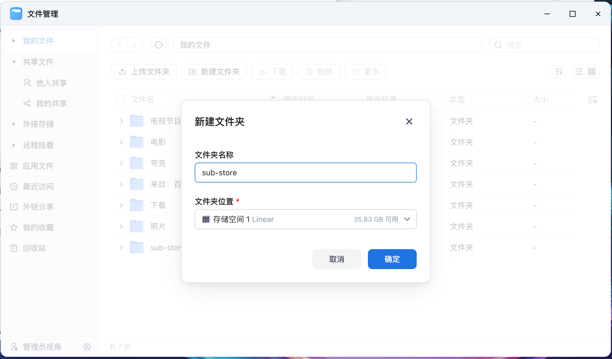
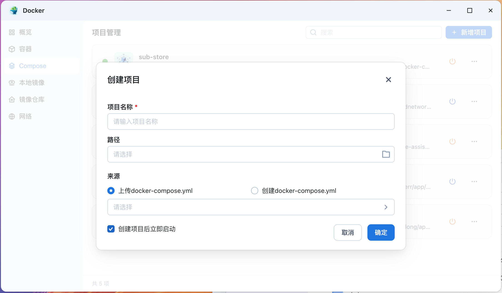

# 自建 Sub Store docker-compose 文件

## 使用方法

1. 下载安装 docker
2. 修改 `docker-compose.yml` 的 `SUB_STORE_FRONTEND_BACKEND_PATH`
3. 命令行进入当前目录，运行 `docker-compose up -d`，然后打开 `http://127.0.0.1:3000` 
4. 后端填写刚才修改的 `SUB_STORE_FRONTEND_BACKEND_PATH` 连接即可

## 飞牛部署

1. 现在文件中创建目录 `sub-store`

    

2. 修改 `docker-compose.yml` 的 `SUB_STORE_FRONTEND_BACKEND_PATH`

3. 打开 `Docker` 程序的 `Compose` 页签，`新建项目`，项目名称填写 `sub-store`，路径选择刚才创建的目录 `sub-store`，上传 `docker-compose.yml` 文件，选择 `创建项目后立即启动`

    

4. 启动成功后，打开 `http://{飞牛地址}:3000`

5. 后端填写刚才修改的 `SUB_STORE_FRONTEND_BACKEND_PATH` 连接即可
6. 可以穿透到公网，供手机、平板等其他设备使用
